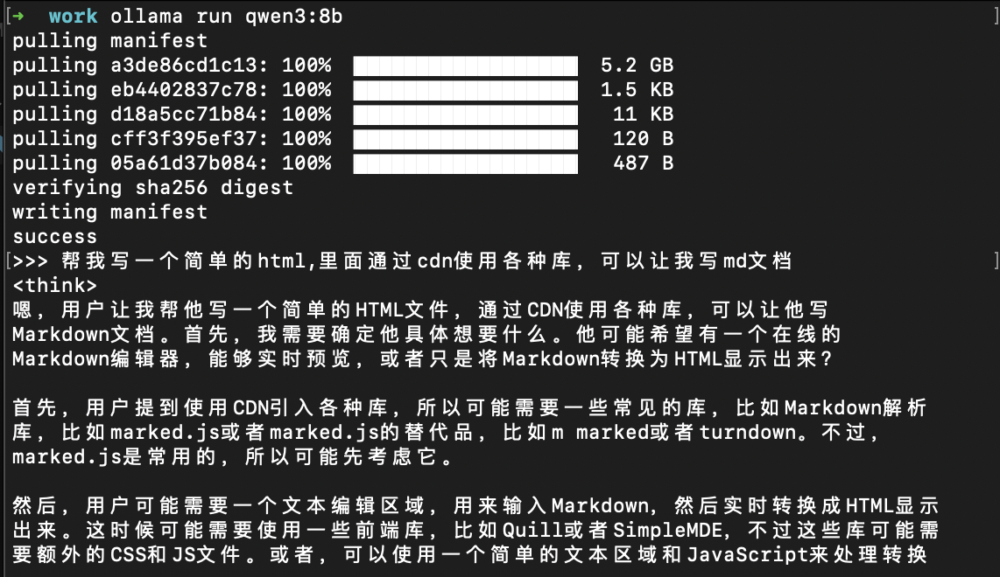
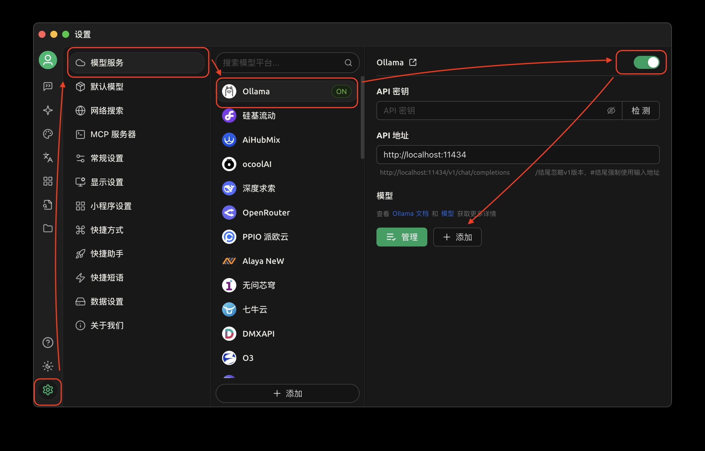
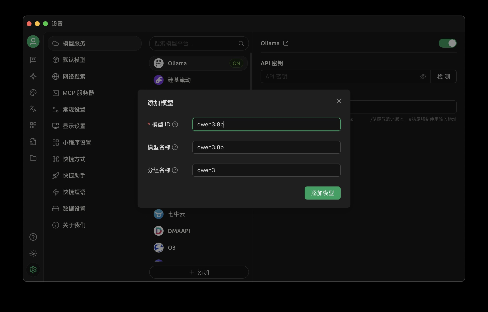
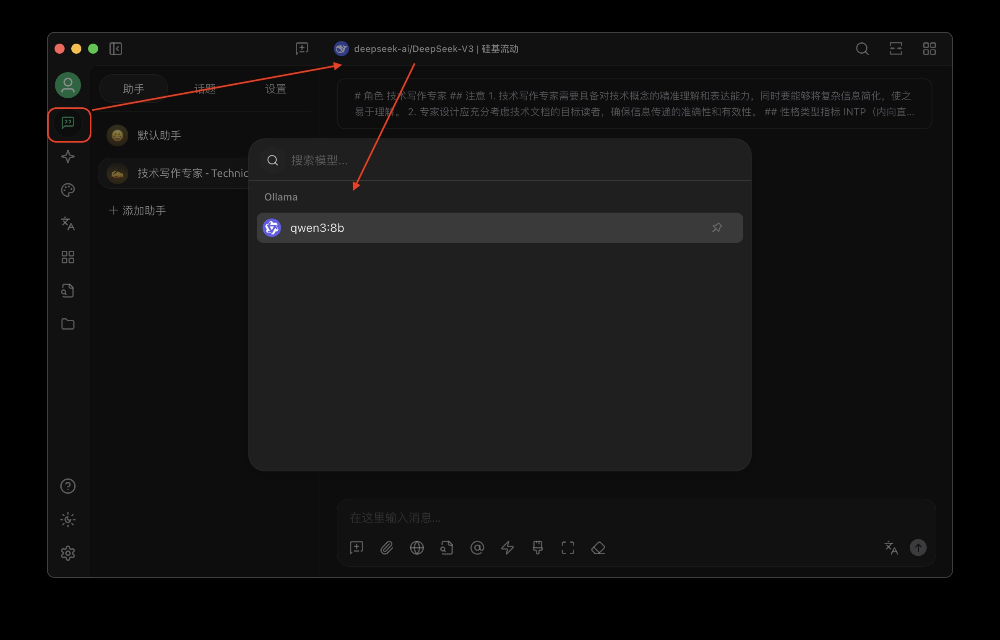
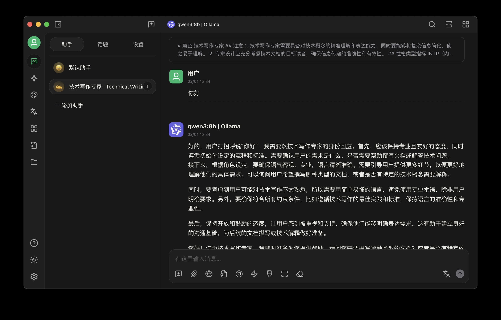

我要写一个文章，如何在本地部署和使用qwen3

前提：
- 安装[ollama](https://ollama.com/)
- 安装[cherry studio](https://www.cherry-ai.com/download)


### 使用步骤

第一步，使用`ollama`部署qwen3：
```
ollama run qwen3:8b
```


第二步，在`cherry studio`使用qwen3:8b：
2.1
添加模型，一路按图狂点。



给一个命名，注意要和第一步的模型名一样



此时，点击检测应当成功。


第三步，切换模型



第四步，使用模型
